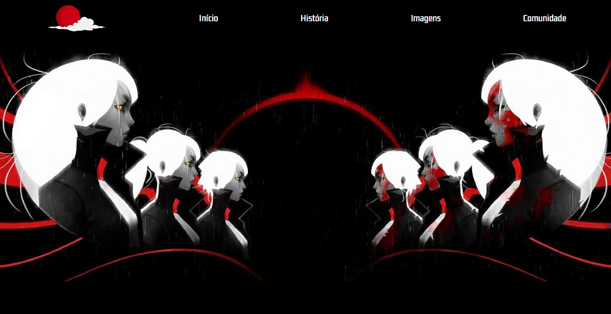

<h1 align="center">Othercide</h1>

Oi! Esse foi meu primeiro trabalho solo e sou um estudante de Desenvolvimento de Sistemas da UNIP.
 

  

## 💻 Projeto

O <i>Othercide</i> é uma página na <i>web</i>  responsivo que apresenta informações sobre <a href="https://www.focus-entmt.com/en/games/othercide" target="_blank">um TRPG do mesmo nome, que adoro, da Focus Entertainment</a>. O site foi desenvolvido utilizando tecnologias basicas como HTML e CSS. Eu me concentrei em criar um design limpo e moderno que fosse fácil de navegar e que apresentasse as informações de maneira clara e organizada.
  
Por ser um trabalho inicial, não incluí páginas tampouco bibliotecas que ajudariam a simplificar o desenvolvimento. Adoraria inserir alguma biblioteca de JavaScript para dar um ar mais sombrio, porém, ainda não cheguei até este conhecimento. 😔
 

## 🤖 Como executei o projeto

Para executar o projeto, comecei criando um esboço do design em um documento de rascunho. Em seguida, criei o HTML básico, adicionando a estrutura principal e os elementos de conteúdo. Em seguida, comecei a estilizar o site com CSS, adicionando cores, fontes e estilos para diferentes elementos.

## 💂 O que aprendi

Este projeto me ensinou muito sobre design responsivo e desenvolvimento web. Aprendi como criar layouts flexíveis e escaláveis que funcionam bem em diferentes dispositivos e como criar uma experiência de usuário sólida e intuitiva.

Também aprendi a importância de testar o site em diferentes dispositivos e navegadores, bem como a importância de seguir as práticas recomendadas de codificação para garantir que o site seja rápido, acessível e fácil de manter.

## 🔖 Conclusão

Este projeto foi um grande desafio, mas também foi uma ótima oportunidade para colocar em prática minhas habilidades de desenvolvimento front-end. Estou animado para continuar aprendendo e aprimorando minhas habilidades à medida que continuo a trabalhar em projetos futuros. ❤️

Você pode visualizar o layout do projeto através <a href="">DESSE LINK</a>.